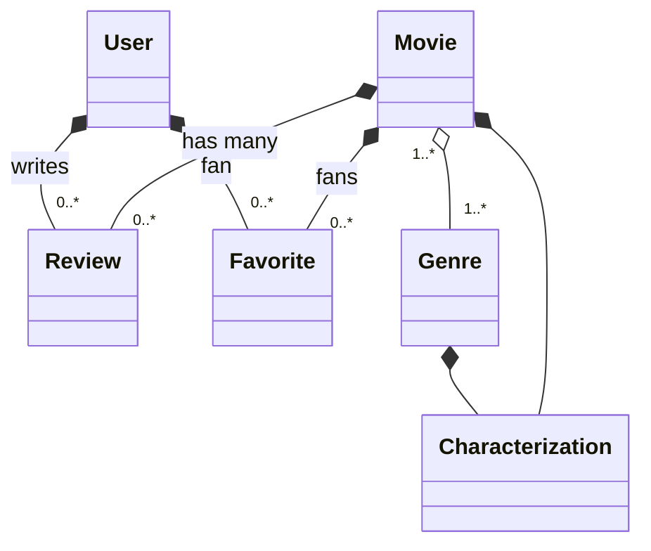

# TODO

* Genres (38)

- Allow the admin to CRUD genres
- Create a Genre show to list movies associated with a genre

* Callbacks and Slugs

https://online.pragmaticstudio.com/courses/rails/steps/94

# README

This README would normally document whatever steps are necessary to get the
application up and running.

Things you may want to cover:

* Ruby version

  ruby: 2.6.5p114
  rails: 6.0.1

* System dependencies

* Configuration

* Services (job queues, cache servers, search engines, etc.)

* Deployment instructions

* ...

## Local Development

* Copy the example environment files.

    cp .env/development/database.example .env/development/database
    cp .env/development/web.example .env/development/web

* Build and start the services

    docker compose up

* Database initialization; create, migrate, and seed

    docker compose run --rm web bin/rails db:create db:migrate db:seed

* Run tests

    docker compose run --rm web bin/rails db:test:prepare test

* (Optional) Run a rails console

    docker compose run --rm web bin/rails console

* (Optional) Run a database console

    docker compose run --rm database psql -U postgres -h database flix_development


## Outstanding Questions

* How do I access custom helper methods from the Rails console?

- How do I fix this error when using docker compose

    ➜  flix git:(dockerize) ✗ docker-compose run --rm web bin/rails db:create
    Creating flix_web_run ... done
    error Couldn't find an integrity file
    error Found 1 errors.


    ========================================
      Your Yarn packages are out of date!
      Please run `yarn install --check-files` to update.
    ========================================


    To disable this check, please change `check_yarn_integrity`
    to `false` in your webpacker config file (config/webpacker.yml).


    yarn check v1.22.15
    info Visit https://yarnpkg.com/en/docs/cli/check for documentation about this command.


## Example Users

```
timkuntz+larry@gmail.com - larrystooge
timkuntz+moe@gmail.com - moestooges
timkuntz+curly@gmail.com - curlystooges
timkuntz+shemp@gmail.com - shempstooges
```

## Domain Model


