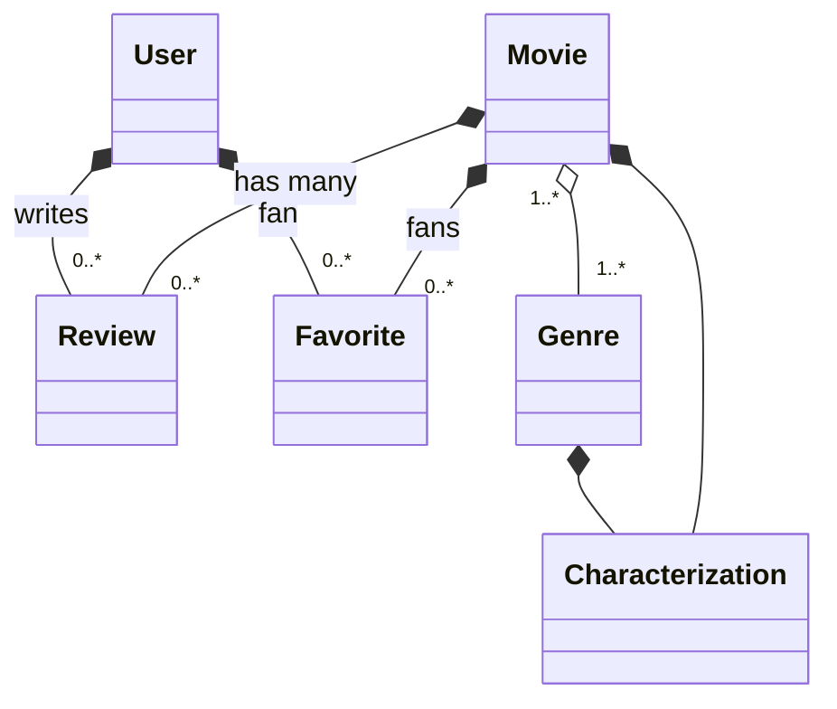

# TODO

* Genres (38)

- Allow the admin to CRUD genres
- Create a Genre show to list movies associated with a genre

* Callbacks and Slugs

https://online.pragmaticstudio.com/courses/rails/steps/94

* 

# README

This README would normally document whatever steps are necessary to get the
application up and running.

Things you may want to cover:

* Ruby version

* System dependencies

* Configuration

* Database creation

* Database initialization

* How to run the test suite

* Services (job queues, cache servers, search engines, etc.)

* Deployment instructions

* ...

## Outstanding Questions

* How do I access custom helper methods from the Rails console?

## Example Users

```
timkuntz+larry@gmail.com - larrystooge
timkuntz+moe@gmail.com - moestooges
timkuntz+curly@gmail.com - curlystooges
timkuntz+shemp@gmail.com - shempstooges
```

## Domain Model


